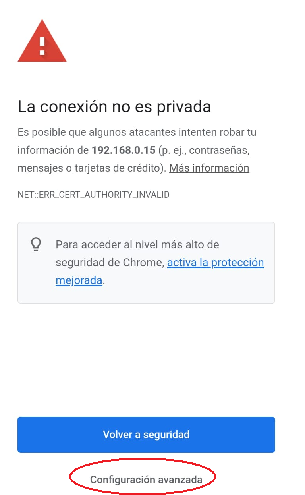
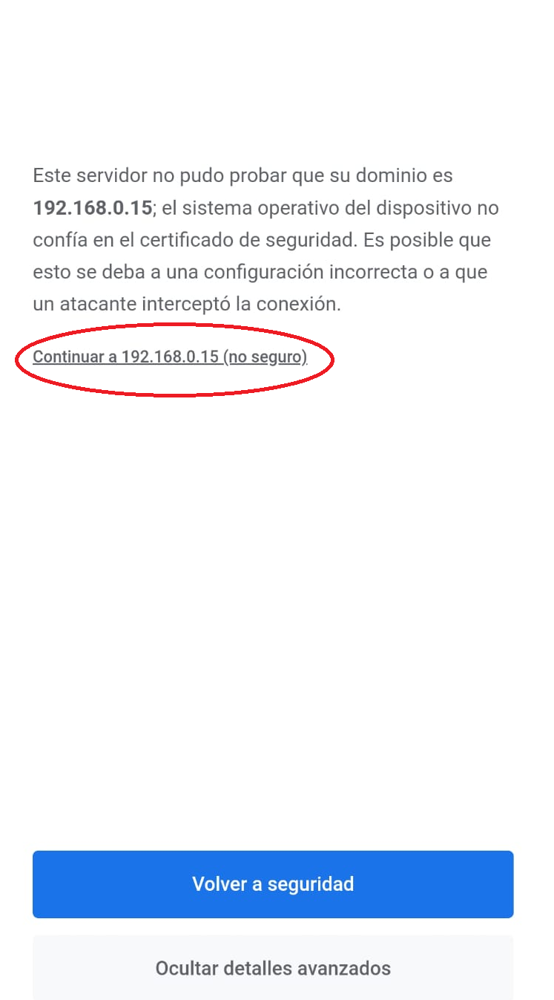

# Ejemplos de clase

En la raiz del repo encontrará la carpeta "drone_drome", el objetivo de este ejemplo será lanzar el simulador del drone para demostrar lo que estaremos realizando en el curso.

### 1 - Setup
Este programa lo lanzaremos en su máquina (PC), no en la máquina virtual (VM). Para ello debe tener instalada la versión 3.7 de Python o superior.\
Instale las librerias que se comentan en requirements.txt de "drone_demo":
```sh
$ pip3 install -r requirements.txt
```

__IMPORTANTE__: En caso de que los mensajes desde el celular no lleguen al servidor, instalar eventlet:
```sh
$ pip3 install eventlet==0.33.1
```

Ingresar al archivo ".env" y modificar "<usuario_campus>" con su usuario del campus.

### 2 - Lanzar aplicación
Teniendo la consola del Visual Studio Code dentro de la carpeta de "drone_demo" lanzar:
```sh
$ python app.py
```

### 3 - Ingresar a la aplicación desde el celular
En la consola aparecerá tanto la IP "127.0.0.1" como la IP verdadera (algo empezado en 192.168) del servidor Flask. Debe copiar esa URL y colocarla en su celular. Importante que ingrese como "https":
```sh
https://<ip_host_flask>:5010
```

__IMPORTANTE__: La aplicación se desarrollo con certificados SSL no verificados, es por ello que cuando ingrese a la URL el explorador le consultará si "está seguro" que desea ingresar a la página "no segura".

Debe aceptar cada una de las pantallas de advertencia que le aparecerá:






### 4 - Interactuar con la aplicación
Cada vez que apague o encienda las luces o motores del Drone se verá reflejado en el dashboardiot creado para este curso:
```
http://inoveiot.herokuapp.com/login
```

Para logearse utilice su nombre de usuario del campus y como password ingrese:
```
inoveiot
```

Esta es una demostración de lo que se estará realizando a lo largo de la cursada.

